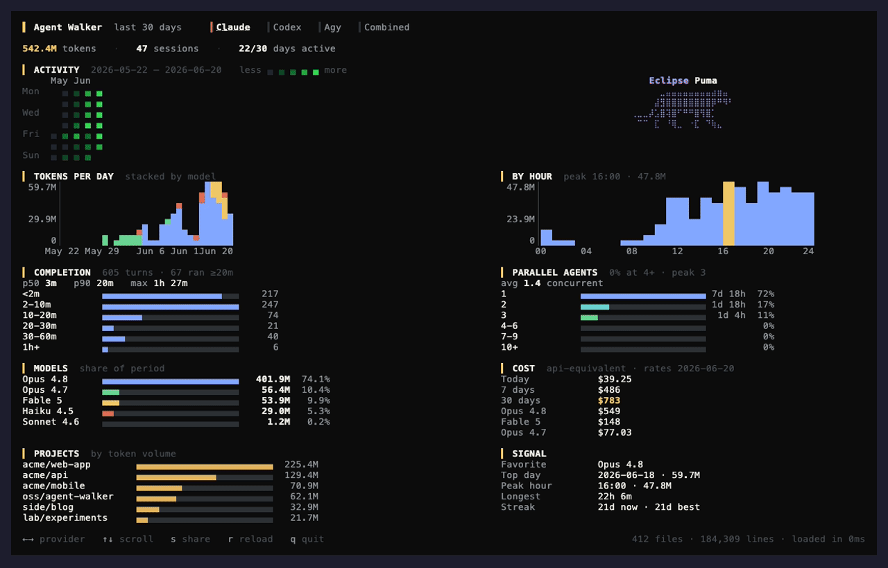
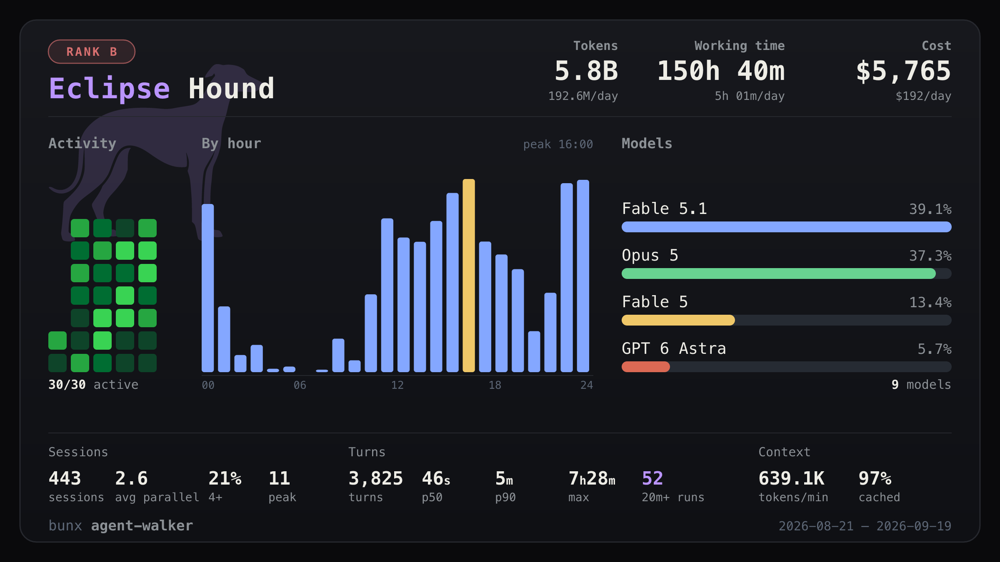

# agent-walker

[](https://github.com/miiiiiiich/agent-walker/actions/workflows/ci.yml)
[](#ライセンス)
[](https://www.rust-lang.org)

**English: [README.md](README.md)**

**自分の AI エージェントが、どこを歩いたか見えてるか。**

AI エージェントがマシンに残すログから作る、ローカルのターミナル・ダッシュボード。消費トークン、API 換算コスト、プロジェクト、ツール、自律度 — 1ヶ月ぶんの稼働を1画面に。使い込むと codename がもらえる。

*抑止できるのは、見ている者だけだ。*



## なぜ

サブスク型の AI ツールは、自分が実際どれだけ使っているかを教えてくれない。ディスク上のセッションログを読んで、1画面でこれに答える：

- **API なら、いくらかかってた？** — キャッシュを考慮したコスト窓（今日 / 7日 / 30日 / 期間）。サブスクの元が取れてるか分かる。
- **トークンはどこへ消えた？** — エージェント横断のリポジトリ別内訳。
- **いつ・どのモデルで？** — GitHub 風アクティビティ、モデル別の積み上げ棒、時間帯プロファイル（ローカル時刻）。
- **放置で回せてる？** — 20分超の自律稼働を重視したターン時間ヒストグラム。
- **トークンを稼いでるスキルはどれ？** — Claude タブのスキル別 30日内訳（スキル帰属を記録する Claude Code バージョンで）。
- **プランの枠、どこまで攻めてた？** — Codex タブに 5時間枠の使用率の日次ピーク履歴。ライブメーターではなく履歴。
- **どう考えさせてる？** — 拡張思考が実際に発火したターンの割合（Claude）と reasoning effort の使い分け（Claude / Codex）。

## プライバシー

- ログは**マシンの外に出ない** — 利用状況やエラーをサーバーに送ることはしない。
- 常時の outbound 通信は、ダッシュボードがレポートを読み込み・再読み込みするときに発行する、公開モデル価格メタデータ（[LiteLLM 価格DB](https://github.com/BerriAI/litellm)・MIT ライセンス）への `GET` だけ。ログ内容も利用状況も送らないが、`git pull` と同じく GitHub の CDN 側からは IP が見える。気になるならファイアウォールで遮断する／オフラインで使う。
- **唯一の例外が Cursor。** Cursor にローカルでサインインしていると自動検出され、利用状況を読むためにネットワークへ出る — ローカルにトークンを持たない Cursor 自身の利用状況ダッシュボードに、手元のセッショントークンで問い合わせる。自分のセッション Cookie を Cursor に送って自分の利用状況を読む形。読むものが無ければ（未インストール／サインアウト）スキップ＝送信しないので、サインイン中以外は何も出ない。[docs/cursor.md](docs/cursor.md) 参照。
- リリースバイナリは [GitHub Artifact Attestations](https://docs.github.com/en/actions/concepts/security/artifact-attestations) 付き：

```sh
gh attestation verify agent-walker-aarch64-apple-darwin.tar.xz -R miiiiiiich/agent-walker
```

## 使う

インストール不要 — `npx` / `bunx` がプラットフォーム（macOS Apple Silicon・Linux arm64/x64 GNU・Windows x64）に合ったバイナリを取ってきて実行：

```sh
npx agent-walker
# または
bunx agent-walker
```

| キー | 動作 |
|---|---|
| `←` `→` / `h` `l` / `Tab` | プロバイダ切替（データのあるものだけ・使用量の多い順・Total 最後） |
| `↑` `↓` / `j` `k` / `PgUp` `PgDn` | スクロール |
| `1`–`9` | タブへジャンプ |
| `r` | リロード |
| `s` | カードを共有（画像コピー / OS の Downloads フォルダに保存） |
| `q` / `Esc` / `Ctrl-C` | 終了 |

フラグ：

| フラグ | 何をする |
|---|---|
| `--days <N>` | グラフの集計期間（既定 30。codename のトークン量レベルは常に直近 30 日からとるので、`--days` を変えても rank はぶれない） |
| `--share <path>` | カードを PNG 出力＋キャプション表示して終了 |
| `--no-cache` | パースキャッシュを無視して全再走査 |
| `--no-cursor` | Cursor コレクタを無効化。Cursor はマシン外に資格情報（Cursor のセッション cookie を cursor.com へ）を送る唯一のコレクタなので、これを付けるとネットワークリクエストを一切行わない |
| `--claude-dir` / `--codex-dir` / `--agy-dir` / `--opencode-dir` / `--copilot-dir` / `--grok-dir` | 非標準のログ場所を指定（`CLAUDE_CONFIG_DIR` / `CODEX_HOME` / `OPENCODE_HOME` / `COPILOT_HOME` / `GROK_HOME` も自動で読む） |
| `--cursor-state-db` | 非標準の Cursor `state.vscdb` を指定（または `CURSOR_TOKEN` でセッショントークンを直接渡す） |
| `--completions <shell>` | シェル補完を出力して終了 |

## codename を共有

ダッシュボードで `s`（または `agent-walker --share card.png`）を押すと共有カードを描く。トークン数を主役にせず、*どう* 使っているか — アクティビティ、時間帯のリズム、モデル内訳、並列度とタスク時間 — を見せる。

使い込むと **codename** がもらえる — E から SS までのランクを昇る一本のはしごで、各ランクは数段のステップに割れていて、1 段が 1 匹。Ant から Lion まで全 24 匹が通過点。線がどこに引いてあるかは伏せてある。リポジトリ名はカードに出ないので、一目だけ確かめて投稿を。



## 対応エージェント

全部自動検出 — 何も入れず、何も設定せず、ただ実行するだけ。

| エージェント | トークン・コスト | モデル | プロジェクト | ツール | アクティビティ |
|---|:---:|:---:|:---:|:---:|:---:|
| **[Claude Code](docs/claude.md)** | ✅ | ✅ | ✅ | ✅ | ✅ |
| **[Codex CLI](docs/codex.md)** | ✅ | ✅ | ✅ | ✅ | ✅ |
| **[OpenCode](docs/opencode.md)** | ✅ | ✅ | ✅ | ✅ | ✅ |
| **[Grok Build](docs/grok.md)** | ✅ | ✅ | ✅ | ✅ | ✅ |
| **[GitHub Copilot CLI](docs/copilot.md)** | ✅ | ✅ | ✅ | ✅ | ✅ |
| **[Cursor](docs/cursor.md)** | ✅ | ✅ | — | — | ✅ |
| **[Antigravity](docs/agy.md)** | ✅ | ✅ | ✅ | ✅ | ✅ |

**Cursor 以外はローカル完結**。Cursor だけはローカルに利用状況が無いので、Cursor 自身のダッシュボードからネットワーク越しに読む（サインイン中だけ・[プライバシー](#プライバシー)参照）。各エージェントの詳細ページに、何を読むか・トークン/キャッシュ/コストの数え方・注意点を書いてある（英語）。

並列パース＋ファイル単位キャッシュ（`~/.cache/agent-walker/`）で、warm start は `(mtime, size)` が変わったログファイルだけ再パースする。ログは信頼しない入力として扱い、壊れた行は数えてスキップ（評価はしない）。

### 30日より前も残すには

Claude Code は既定で**約30日でトランスクリプトを整理する**ことがある（`cleanupPeriodDays` 次第）。最初はこの設定次第で直近1ヶ月しか出ないこともある。1年残すなら `~/.claude/settings.json` に：

```json
{ "cleanupPeriodDays": 365 }
```

整理はセッション開始時に走る＝すでに消えたものは戻らないので早めに。Codex はセッションを保持（設定不要）。

### 注意・制約

- コストは **API 換算の見積もり**（実請求ではない）。LiteLLM の価格、キャッシュ読み書きは別レート。pricing fetch 日付は、pricing が読めて端末幅に余裕があるとき COST パネルに表示される。
- トークンは**キャッシュ込み**（入力 + 出力 + キャッシュ書込 + 読込）。Claude は毎ターン全コンテキストを再送するので、ヘビーに使うほど合計の大部分はキャッシュ読込＝安価な再読込で、新規の作業量とは別物。
- **Antigravity のトークンはラベル無し protobuf（会話ごと SQLite）から読む**。フィールド番号でデコードし行ごとに自己検証するので合計に加算される。コストは Gemini モデルの表示名から、他エージェントと同じ LiteLLM 価格表で見積もる。
- 各エージェント自身の利用表示とは一致しない（集計の窓やキャッシュの数え方が違う）。
- Antigravity のログのタイムスタンプはタイムゾーンなし＝ローカル想定。
- Windows バイナリは 0.3 以降で配布。Windows Terminal / PowerShell で動き、ログは `%USERPROFILE%` から読む。WSL でもそのまま動く（パスは Linux 形式のまま）。

## 謝辞

[ccusage](https://github.com/ccusage/ccusage) は AI コーディングエージェントのローカル利用量トラッキングの先駆者で、agent-walker が扱う問題のいくつかを最初に特定・解決した。[THIRD_PARTY_NOTICES](THIRD_PARTY_NOTICES) も参照。

## ライセンス

MIT または Apache-2.0、好きな方で。
